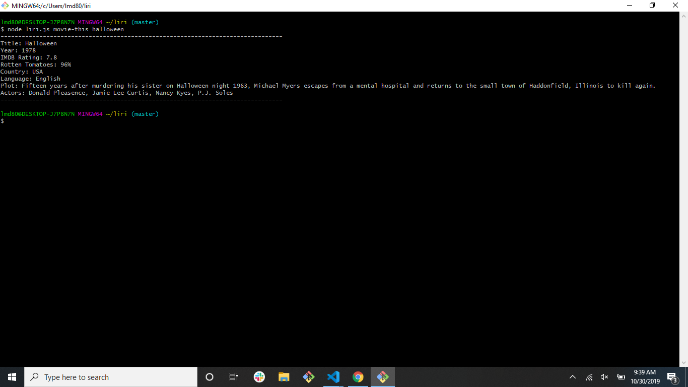

# liri

## Problem 
Liri will allow the user to look up bands, movies and music based on their user input. It will save the user time from having to look it up. 

## Local Usage
* Clone this repo to your computer
* In the project directory, run `$npm install`
* Edit `PORT` and `.env` configuration if necessary/desired 
* Run `npm start` or `node app` to start your server and use this project on your own

## Technologies: 
* [Javascript](https://www.javascript.com/) - The scripting language used to manipulate the DOM. 
* [Node](https://nodejs.org/en) - Javascript run-time environment (used to execute server side code.)
* [Axios](https://www.npmjs.com/package/axios) - Promise based HTTP client for the browser and node.js
* [Spotify API](https://www.npmjs.com/package/node-spotify-api) - A simple to use API library for the Spotify REST API.

## Structure

This application takes in 6 commands and user input (ie. band names, songs, and movies). It used the commands to call specific functions in order to effectively gather data on the users input. 

## Tutorial: 

### Step one: 
* type in a command. They can be any of the following: 
* start, help, concert-this , spotify-this-song , movie-this , do-what-it-says 

See images below: 
concert-this command 

spotify-this-song command 

movie-this command 

do-what-it-says command

### Step Two: 
* type in an input. The concert-this command take in a parameter of a band name or artist. The spotify-this-song  command takes in a parameter of a song. The movie-this command takes in a parameter of a movie title. Finally, the do-what-it-says command does not take a parameter. It will read the random.txt file. NOTE: THE PARAMETERS MUST BE IN QUOTATIONS!!! 
#### See Images Below: 

* concert-this command 

* spotify-this-song command 

* movie-this command 

* do-what-it-says command
NOT APPLICABLE 

### Step Three: 
* Press the enter key. It will return results for you based on your command and input. 
#### See Images Below: 
* concert-this command 

* spotify-this-song command 

* movie-this command 

* do-what-it-says command

## Link to deployed version 
[Will only Display the ReadMe](https://lmd808.github.io/liri/)

## Link to Repo: 
[Repo](https://github.com/lmd808/liri) 

## Creator
Laura DiTommaso [GitHub](https://github.com/lmd808)

